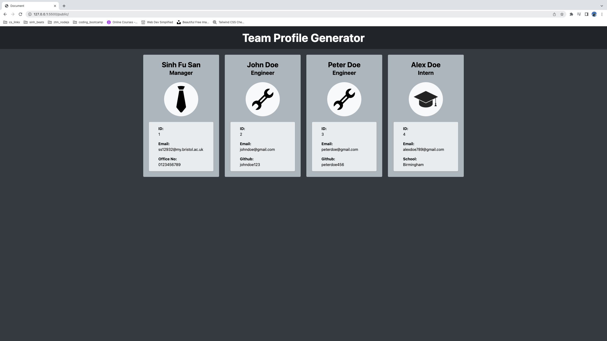

# team-profile-generator 

## Table of Contents

- [Description](#description)
- [Installation](#installation)
- [Screenshot](#screenshot)
- [Video Link](#video-link)
- [Usage](#usage)
- [Contributing](#contributing)
- [Tests](#tests)
- [Questions](#questions)

## Description

This week's assignment is to build a Node.js CLI application that takes in information about employees on a software engineering team , then generates a HTML webpage that displays summaries for each person. This application will be following TDD principles using jest to make code more maintainable.

## Screenshot

## Video Link

[Google Drive Link](https://drive.google.com/file/d/1F-501QDxXzUq190WRqA6hEuaJwT8y5Iz/view)

## Installation

Please follow the instructions below:

In order to generate your own team profile template. please git clone this application onto your local machine. Follow this video [here](https://drive.google.com/file/d/1F-501QDxXzUq190WRqA6hEuaJwT8y5Iz/view) which will provide a walkthrough of the whole installation and usage process.

Once cloned onto your local machine through your terminal, Next run `npm install` or `npm i` in order to install all the npm package dependencies needed to run the application.

After installing all the dependencies, please run `npm run start` in your terminal in order to launch the application.

## Usage

Please follow the instructions below:

When you run the `npm run start` command using the command line terminal mentioned above, the application will initiate the inquirer package and run you through a series of prompts about your team members. After answering all the prompts successfully, you will be guided by a final confirm prompt which will ask if you want to add additional team members. If all members have been added, the team profile template will be generated in the `index.html` located in the public folder.

## License

This Project is licensed under MIT License, for more information please visit: [License](https://choosealicense.com/licenses/mit/)

MIT License

## Contributing

None

## Tests

Please follow the instructions below:

Please run `npm run test` in order to run the jest tests of the application.

## Questions

Please contact me on my email: ss12932@my.bristol.ac.uk
